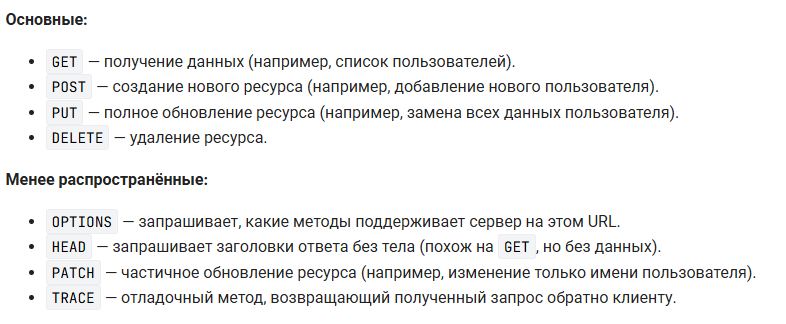

# HTTP
## Основные методы


**Популярные методы**
```python
from fastapi import FastAPI

app = FastAPI()

@app.get("/users")
def get_users():
    return {"message": "Список пользователей"}

@app.post("/users")
def create_user():
    return {"message": "Создан новый пользователь"}

@app.put("/users/{user_id}")
def update_user(user_id: int):
    return {"message": f"Пользователь {user_id} обновлён"}

@app.delete("/users/{user_id}")
def delete_user(user_id: int):
    return {"message": f"Пользователь {user_id} удалён"}
```

**Непопулярные методы**
```python
@app.options("/")
def options_example():
    return {"message": "Этот запрос проверяет, какие методы доступны"}

@app.head("/")
def head_example():
    return {"message": "Ответ без тела (только заголовки)"}

@app.patch("/users/{user_id}")
def patch_user(user_id: int):
    return {"message": f"Пользователь {user_id} частично обновлён"}

@app.trace("/")
def trace_example():
    return {"message": "TRACE-запрос вернёт сам себя"}
```


## Работа с формами

В дополнение к работе с JSON, FastAPI поддерживает обработку данных, отправляемых из HTML-форм. Это важно при интеграции API с веб-приложениями, которые используют классические формы для отправки данных.

Как FastAPI работает с формами
В HTML-формах данные отправляются в формате application/x-www-form-urlencoded. FastAPI позволяет обрабатывать такие запросы с помощью Form

```html
<form action="http://127.0.0.1:8000/register/" method="post">
    <input type="text" name="username" placeholder="Имя пользователя" required>
    <input type="email" name="email" placeholder="Email" required>
    <input type="number" name="age" placeholder="Возраст" required>
    <input type="password" name="password" placeholder="Пароль" required>
    <button type="submit">Зарегистрироваться</button>
</form>
```
> Form(...) — указывает FastAPI, что данные параметра поступают из HTML-формы, а не JSON.

> Обрати внимание на `http://127.0.0.1:8000/register/` и его связь с `@app.post("/register/")`


```python
from fastapi import FastAPI, Form


@app.post("/register/")
async def register_user(
    username: str = Form(...),
    email: str = Form(...),
    age: int = Form(...),
    password: str = Form(...)
):
    return {
        "username": username, 
        "email": email, 
        "age": age, 
        "password_length": len(password)
    }
```

## Работа с JSON
 FastAPI использует модели Pydantic для автоматической проверки и анализа входящих данных запроса. Модели запросов помогают гарантировать, что входящие данные соответствуют указанной структуре и типам, в то время как модели ответов могут использоваться для определения структуры данных, возвращаемых вашим API.

FastAPI автоматически проверяет данные входящего запроса на соответствие определённым моделям Pydantic. Если данные не соответствуют указанной схеме, FastAPI возвращает ответ об ошибке с подробным объяснением ошибок проверки.

```python
from fastapi import FastAPI
from pydantic import BaseModel

app = FastAPI()

class User(BaseModel):
    name: str
    age: int

@app.post("/users/")
async def create_user(user: User):
    return {"message": f"Пользователь {user.name} создан!", "user": user}
```


## Работа с файлами

```py
from typing import Annotated  # про это будет чуть позднее в курсе
from fastapi import FastAPI, File, UploadFile

app = FastAPI()

@app.post("/files/")
async def create_file(file: Annotated[bytes, File()]):
    return {"file_size": len(file)}

@app.post("/uploadfile/")
async def create_upload_file(file: UploadFile):
    return {"filename": file.filename}
```

> + File: загружает только содержимое файла в виде bytes, то есть в оперативную память. Хорошо подходит для небольших файлов.

> + UploadFile: позволяет работать с файлами более эффективно, так как использует временные файлы, а не загружает всё в память. Также даёт доступ к метаинформации файла, такой как имя, тип (file.content_type) и метод file.read(), позволяющий читать файл частями.


## Считывания файлов со страницы и работа с ними
```html
<form action="http://127.0.0.1:8000/multiple-files/" method="post" enctype="multipart/form-data">
    <input type="file" name="files" multiple>
    <button type="submit">Отправить</button>
</form>
```

```py
from typing import List

# тут остальной код main.py, который дополним кодом ниже

@app.post("/multiple-files/")
async def upload_multiple_files(files: List[UploadFile]):
    return {"filenames": [file.filename for file in files]}
```